# DevOps Pipeline for React Web Application on AKS

This project demonstrates a complete DevOps pipeline for deploying a **React web application** to **Azure Kubernetes Service (AKS)**. The pipeline includes:

- **CI/CD with GitHub Actions**: Automates building, testing, and deploying the React app.
- **Containerization with Docker**: Packages the app into a Docker image.
- **Orchestration with Kubernetes (AKS)**: Manages the deployment and scaling of the app.
- **Monitoring with Grafana and Azure Monitor**: Visualizes cluster and application metrics.

---

## Table of Contents
1. [Project Overview](#project-overview)
2. [Pipeline Workflow](#pipeline-workflow)
3. [Step-by-Step Setup](#step-by-step-setup)
4. [Monitoring with Grafana](#monitoring-with-grafana)
5. [Screenshots](#screenshots)
6. [License](#license)

---

## Project Overview

The goal of this project is to automate the deployment of a **React web application** to **Azure Kubernetes Service (AKS)** using **GitHub Actions**. The pipeline includes:

1. **Build and Test**: Automatically builds and tests the React app on every push to the `main` branch.
2. **Deploy to AKS**: Deploys the app to AKS using **Helm charts**.
3. **Monitoring**: Sets up **Grafana** with **Azure Monitor** to visualize cluster metrics.

---

## Pipeline Workflow

The CI/CD pipeline is defined in the [`.github/workflows/main.yaml`](.github/workflows/main.yaml) file. Here's an overview of the workflow:

### 1. Build and Test
- **Checkout Repository**: Pulls the latest code from the repository.
- **Set Up Node.js**: Configures the Node.js environment.
- **Install Dependencies**: Installs npm dependencies.
- **Build**: Builds the React application.
- **Test**: Runs tests (if implemented).

### 2. Deploy to AKS
- **Azure Login**: Authenticates with Azure using credentials stored in GitHub Secrets.
- **Azure ACR Login**: Logs into the Azure Container Registry (ACR).
- **Build and Push Docker Image**: Builds the Docker image and pushes it to ACR.
- **Deploy to AKS**: Deploys the application to AKS using Helm.

---

## Step-by-Step Setup

### Step 1: Set Up Azure Resources
1. **Create an AKS Cluster**:
    - Use the Azure CLI to create a Kubernetes cluster:
      ```bash
      az aks create --resource-group KubeRG --name myAKSCluster --node-count 2 --enable-addons monitoring --generate-ssh-keys
      ```
    - Verify the cluster creation:
      ```bash
      az aks list -o table
      ```

2. **Create an Azure Container Registry (ACR)**:
    - Create an ACR to store Docker images:
      ```bash
      az acr create --resource-group KubeRG --name infraqregistry --sku Basic
      ```

3. **Attach ACR to AKS**:
    - Link the ACR to your AKS cluster:
      ```bash
      az aks update --name myAKSCluster --resource-group KubeRG --attach-acr infraqregistry
      ```

---

### Step 2: Set Up GitHub Actions
1. **Create a GitHub Workflow**:
    - Add the following workflow to `.github/workflows/main.yaml`:
      ```yaml
      name: CI/CD Pipeline on AKS
 
      on:
        push:
          branches:
            - main
        workflow_dispatch:
 
      jobs:
        Build_and_Test:
          runs-on: ubuntu-latest
          steps:
            - name: Checkout repository
              uses: actions/checkout@v2
 
            - name: Set up Node.js
              uses: actions/setup-node@v2
              with:
                node-version: '23.5'
 
            - name: Install dependencies
              run: npm install
 
            - name: Build
              run: npm run build --if-present
 
            - name: Test
              run: npm test # if you have testing implemented in your project
 
        Deploy_to_AKS:
          runs-on: ubuntu-latest
          steps:
            - name: Checkout repository
              uses: actions/checkout@v2
 
            - name: Azure Login
              uses: azure/login@v2
              with:
                creds: ${{ secrets.AZURE_CREDENTIALS }}
 
            - name: Azure ACR Login
              uses: azure/docker-login@v2
              with:
                login-server: ${{ secrets.REGISTRY_NAME }}
                username: ${{ secrets.SP_USERNAME }}
                password: ${{ secrets.SP_PASSWORD }}
 
            - name: Build and Push Docker file
              run: |
                docker build -t ${{ secrets.REGISTRY_NAME }}/${{ secrets.IMAGE_NAME }}:${{ github.sha }} .
                docker push ${{ secrets.REGISTRY_NAME }}/${{ secrets.IMAGE_NAME }}:${{ github.sha }}
            - name: Deploy to AKS
              run: |
                az aks get-credentials --resource-group KubeRG --name myAKSCluster
                helm upgrade --install web-app ./web-app \
                  --set image.repository=${{ secrets.REGISTRY_NAME }}/${{ secrets.IMAGE_NAME }} \
                  --set image.tag=${{ github.sha }}
      ```

2. **Add GitHub Secrets**:
    - Go to your repository settings and add the following secrets:
        - `AZURE_CREDENTIALS`: Azure service principal credentials.
        - `REGISTRY_NAME`: Name of your Azure Container Registry (ACR).
        - `IMAGE_NAME`: Name of the Docker image.
        - `SP_USERNAME`: Service principal username.
        - `SP_PASSWORD`: Service principal password.

---

### Step 3: Deploy the Application
1. **Push Code to GitHub**:
    - Push your code to the `main` branch to trigger the pipeline:
      ```bash
      git add .
      git commit -m "Initial commit: Added React app code"
      git push origin main
      ```

2. **Verify Deployment**:
    - Check the status of the deployment in the **GitHub Actions** tab.
    - Verify the app is running in AKS:
      ```bash
      kubectl get pods
      kubectl get services
      ```

---

## Monitoring with Grafana

### Step 1: Install Grafana
1. **Install Grafana using Helm**:
    - Add the Grafana Helm repository:
      ```bash
      helm repo add grafana https://grafana.github.io/helm-charts
      helm repo update
      ```
    - Install Grafana in the `monitoring` namespace:
      ```bash
      helm install grafana grafana/grafana --namespace monitoring
      ```

2. **Access Grafana**:
    - Get the Grafana admin password:
      ```bash
      kubectl get secret --namespace monitoring grafana -o jsonpath="{.data.admin-password}" | base64 --decode ; echo
      ```
    - Forward the Grafana service to your local machine:
      ```bash
      kubectl port-forward --namespace monitoring service/grafana 3000:80
      ```
    - Open Grafana in your browser at `http://localhost:3000` and log in using the username `admin` and the password retrieved above.

---

### Step 2: Configure Azure Monitor
1. **Add Azure Monitor as a Data Source**:
    - In Grafana, go to **Configuration > Data Sources**.
    - Click **Add data source** and select **Azure Monitor**.
    - Fill in the required fields:
        - **Name**: `Azure Monitor`
        - **Subscription ID**: Your Azure subscription ID.
        - **Tenant ID**: Your Azure tenant ID.
        - **Client ID**: The client ID of your Azure service principal.
        - **Client Secret**: The client secret of your Azure service principal.
    - Click **Save & Test** to verify the connection.

2. **Create Dashboards**:
    - Go to **Dashboards > New Dashboard**.
    - Add panels to visualize metrics such as:
        - **CPU Usage**: Monitor the CPU usage of your AKS cluster.
        - **Memory Usage**: Track memory consumption.
        - **Number of Pods**: Visualize the number of running pods.
    - Save the dashboard for future use.

---

## Screenshots

Here are some screenshots from the project to help you visualize the setup:

### 1. Create Resource Group and AKS Cluster
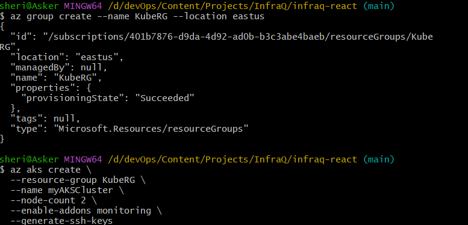
*Creating the resource group `KubeRG` and AKS cluster `myAKSCluster` using Azure CLI.*

---

### 2. AKS Cluster Creation Confirmation
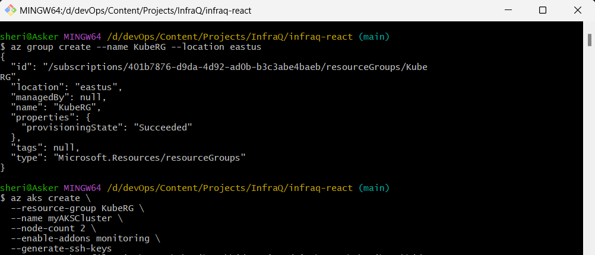
*Confirmation of the AKS cluster creation with details like resource group, location, and provisioning state.*

---

### 3. Create Azure Container Registry (ACR)
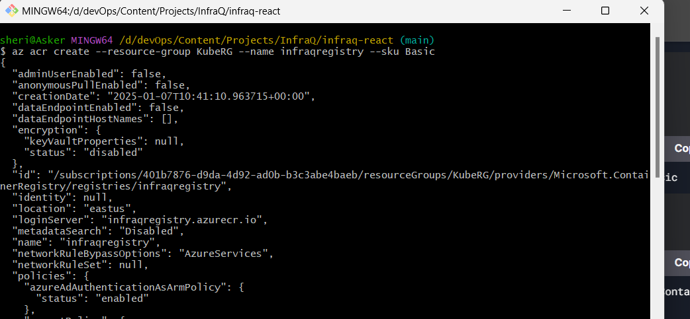
*Creating the Azure Container Registry (ACR) named `infraqregistry` to store Docker images.*

---

### 4. Attach ACR to AKS Cluster
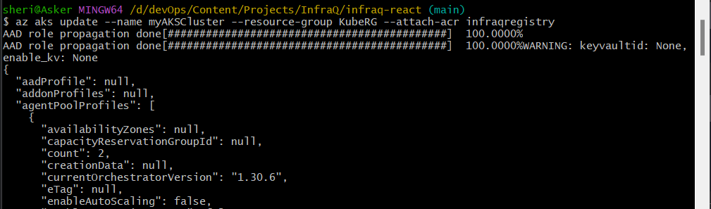
*Attaching the ACR to the AKS cluster to enable seamless image pulls during deployment.*

---

### 5. Get AKS Cluster Credentials
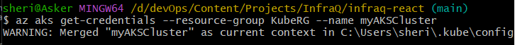

*Fetching the credentials for the AKS cluster to interact with it using `kubectl`.*

---

### 6. Verify Kubernetes Resources
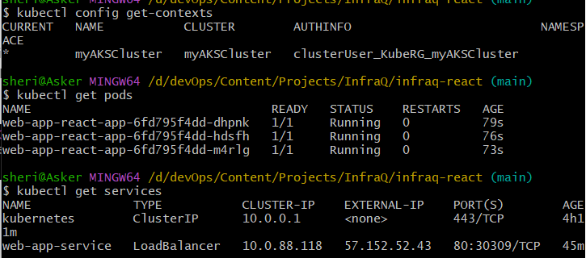
*Checking the running pods and services in the AKS cluster after deployment.*

---

### 7. Create Monitoring Namespace
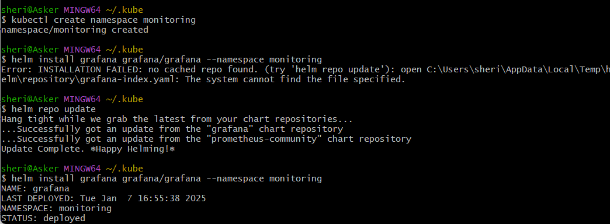
*Creating the `monitoring` namespace for Grafana and Prometheus installation.*

---

### 8. Install Grafana using Helm
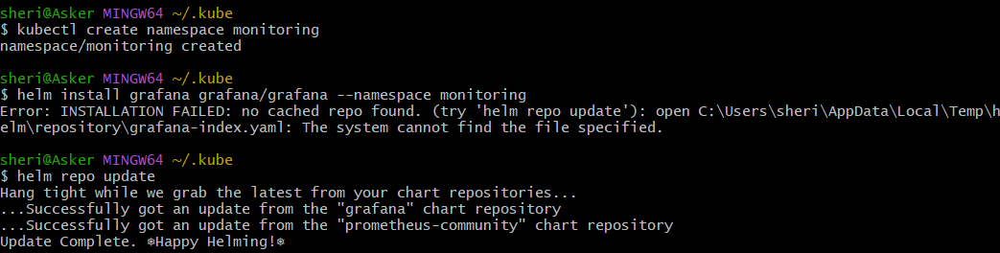
*Installing Grafana in the `monitoring` namespace using Helm.*

---

### 9. Grafana Deployment Status
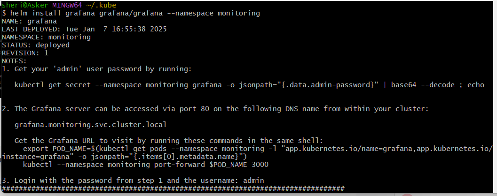
*Grafana successfully deployed with instructions to access the admin password and URL.*

---

### 10. Port Forward Grafana Service
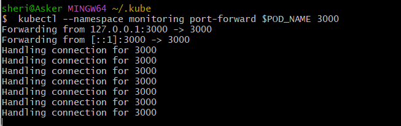
*Forwarding the Grafana service to access it locally on port 3000.*

---

### 11. Grafana Login Page
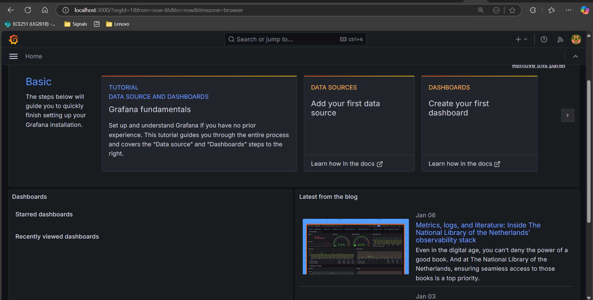
*Grafana login page accessed via port forwarding.*

---

### 12. Enable Monitoring Add-ons for AKS
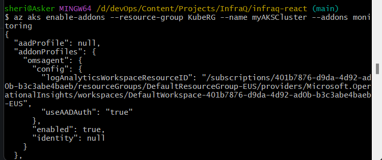
*Enabling monitoring add-ons for the AKS cluster to collect metrics.*

---

### 13. Configure Azure Monitor Data Source
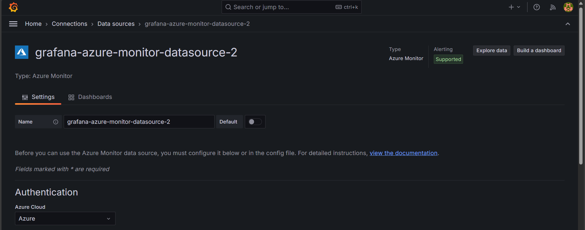
*Adding Azure Monitor as a data source in Grafana for advanced metrics collection.*

---

### 14. Grafana Dashboard Configuration
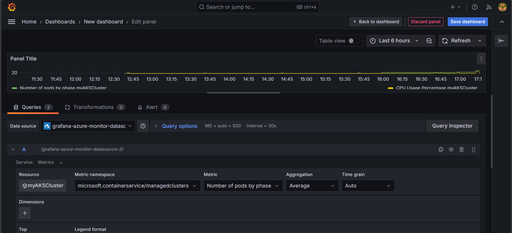
*Configuring a Grafana dashboard to visualize AKS cluster metrics like CPU usage and pod count.*

---

### 15. Grafana Query Editor
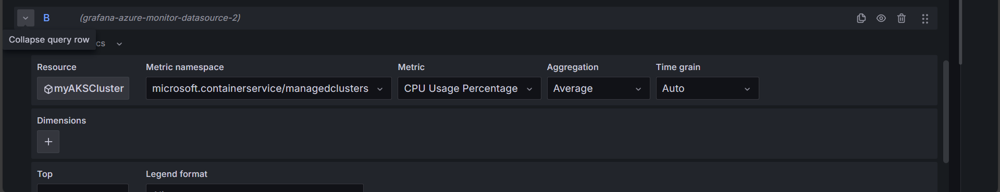
*Editing queries in Grafana to customize metrics visualization.*

---

### 16. Grafana Metrics Visualization
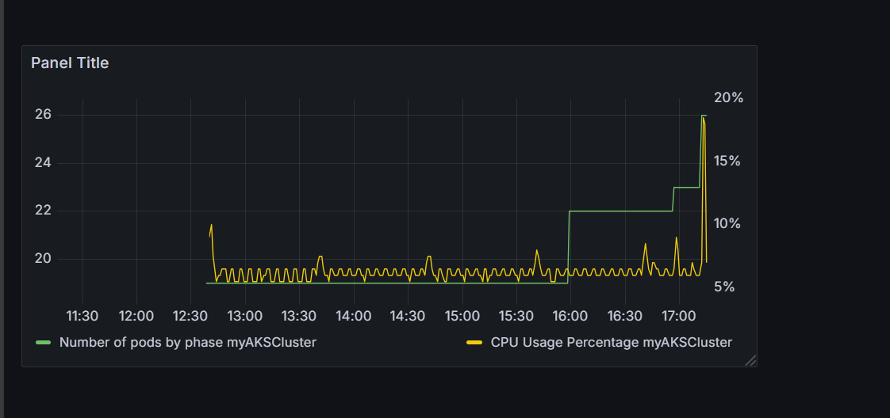
*Visualizing AKS cluster metrics like CPU usage and pod count in Grafana.*

---


### 17. Kubernetes Services Overview
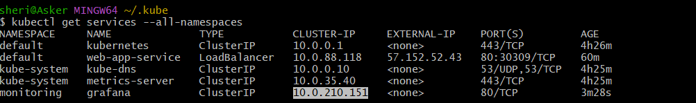
*Overview of Kubernetes services running in the cluster, including the React app service.*
---

### 18. Terraform Code Generation
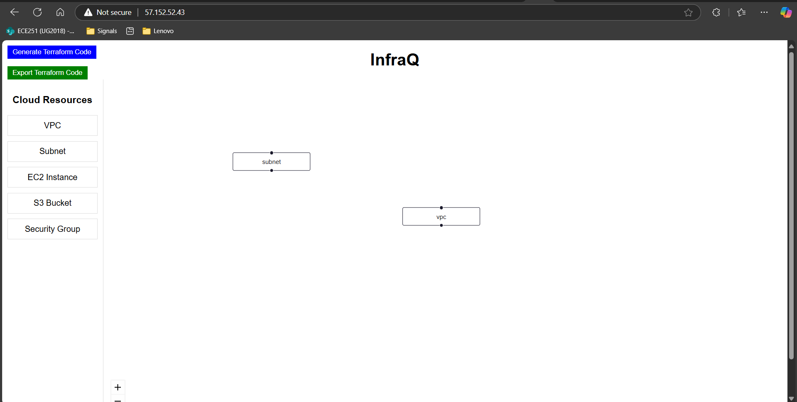
*React web application that generates Terraform code for infrastructure as code (IaC) setup.*

---


## License

This project is licensed under the **MIT License**. See the [LICENSE](LICENSE) file for details.

---

### How to Contribute
If you'd like to contribute to this project, feel free to:
1. Fork the repository.
2. Create a new branch for your feature or bug fix.
3. Submit a pull request with your changes.

---

### Acknowledgments
- **GitHub Actions**: For enabling seamless CI/CD pipelines.
- **Azure Kubernetes Service (AKS)**: For providing a robust Kubernetes platform.
- **Grafana**: For powerful monitoring and visualization capabilities.

---
   
